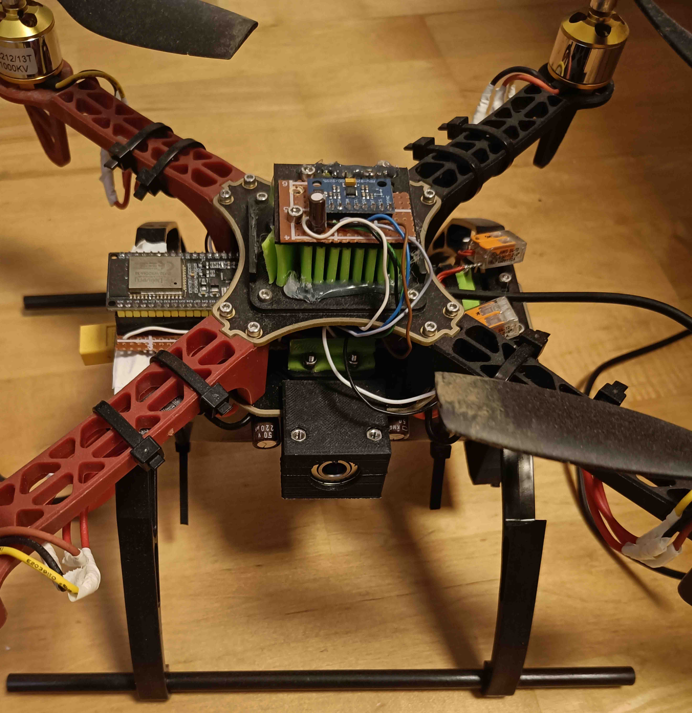

# My Flightcontroller for a Quadcopter

## 1. Overview
This README is intended to be a short documentation of the quadcopter I engineered over the course of 8 months.

First of all, I want to thank Nicholas Rehm for his dRehmFlight project, whose code I analyzed and which helped me tremendously to create the foundation and basic structure of my flight controller.
My flight controller is based on an ESP32-WROOM. It communicates via long-range ESP-NOW with a second ESP32-WROOM that serves as the controller to steer the drone. The loop rate is limited to 2 kHz, as the motor controllers are not able to update faster, and a loop rate of 2 kHz proves to be more than sufficient for this size of quadcopter, even though the ESP32 would be capable of running the code at approximately 11 kHz.
The orientation estimation is performed via a 6-DOF IMU and a 6-DOF Madgwick filter. The IMU is connected via SPI and can be virtually leveled (inside the ESP32 software), which makes the mechanical design much easier.
The control loop is leveling the drone to a certain angle provided by the controller uC.

## 2. Quick Demo
The following link provides a short [demonstration video](https://youtu.be/AJdvR4KB-JM).

## 3. Technical Summary

The most interesting parts about the image above are the vibration damper for the IMU made out of 3D-printed green TPU, which reduces high-frequency noise from the motors tremendously. Furthermore, one 3D-printed bracket for the PID test stand can be seen under the IMU, printed in black PLA with a silver ball bearing.

This picture shows the BL-DC ESCs that run on BLHeli firmware and claim to support up to 45 A continuous current for 2S to 6S batteries. Parallel capacitors were soldered on to prevent unwanted reboots of the ESCs during high changes in current, as the built-in capacitors were not sufficient. The PID test stand brackets can also be seen in this picture, positioned between the capacitors.

## 4. Engineering Journey
### 4.1 First prototype
Early on I was determined to use two ESP32s for my quadcopter project and let them communicate over ESP-NOW long range, as I had already done with an RC car I built in the summer holidays before.
I started this project in the Christmas holidays, and the first prototype was ready for flight tests after about 1.5 months. However, it proved that a flying quadcopter is not as simple to create as some YT guys explain it to be. The first prototype used the most basic BL-DC ESCs on the market. These ESCs have the same control interface as standard hobbyist servos do, i.e. a PWM signal with a frequency of 50 Hz. The IMU used in the first prototype was a BNO055 from Bosch, which communicated over I2C with the ESP32. 

### 4.2 Correctly tuning the PID controllers would fix everything!
At least that was my assumption, and I tuned the PID control loops for hours and hours, with some practical results. In the end, I came to the conclusion that the drone was indeed reacting to orientation misalignments but way too slow. I concluded that the orientation algorithm was just too bad, as I used a simple complementary filter for the gyro and accelerometer readings.

### 4.3 *A New Hope* - The standard kalman filter
Now that would solve all my problems! After watching some videos about the Kalman filters and a person who allegedly used it for a drone at a 50 Hz loop rate, I was determined to use it for my drone. The initial optimism faded quickly after realising that The Reality Striked Back, i.e. orientation readings were completely off and had a lot of noise. Additionally, adding 2 parameters to the already existing 9 parameters from the PID controllers did not improve my situation either.
I researched further and got the feeling that my loop rate was simply too slow and decided that I would have to rebuild my drone.

### 4.4 The problems just began - *The I2C Wars*
No problem, I just have to speed up my code. The ESP32 is so fast that this shouldn't be a problem. I thought back to a YT video I saw a few months before about the “dRehmFlight”, a simple flight controller for drones and VTOL aircraft. There I got the magical loop-rate frequency of 2 kHz. The first version was too slow because of the Adafruit IMU library. As a result, I communicated with the IMU over the I2C HAL of the ESP32.
Testing the new code, which should finally run at 2 kHz, brought a lot of confusion: one time the I2C communication lasted 500 µs and another time 2500 µs, for the same number of bytes. After hours of googling and some dinner dates with ChatGPT, I found out that the BNO055 uses I2C clock stretching. Because of this “feature”, the sensor is practically useless for my drone project.

### 4.5 New IMU, New Problems
The MPU6050, a 6-DOF IMU communicating over I2C, would be the solution, as this IC does not use clock stretching and is seemingly capable of overclocking up to 2.5 times the maximum frequency, i.e. 1 MHz, according to the dRehmFlight basic code. Finally, the code was capable of running at 2 kHz, at least for some time. After a few seconds, a communication error caused a complete failure of the ESP32 I2C driver. Moreover, resetting the ESP32 I2C driver and the I2C bus in software did not lead to re-establishing I2C communication with the MPU6050 in a reasonable amount of time. Improving the I2C hardware increased the time until failure significantly. Analyzing the bus via a logic analyzer showed that the clock frequency of 1 MHz was too high for the ESP32 I2C driver. However, lowering the clock frequency was no option, as the 2 kHz loop rate target was barely reachable with the 1 MHz clock frequency.

### 4.6 Switching to SPI - *The Interface Awakens*
Finally, a bus/protocol that was fast enough to handle the speeds necessary for reaching the loop rate goals. With this premise I decided to buy the most popular SPI IMU, the MPU9250. At least I thought I would buy the MPU9250. Luckily, I was already aware of the common problem that occurs when buying the MPU9250, which is: not receiving the MPU9250. 😒
I got the MPU6500, which is still capable of SPI communication. The only downside is that it's a 6-DOF IMU. I decided that I would keep the IMU I got and rewrite the MPU9250 library for the MPU6500. After finishing the library adaptations, I was able to experience the joy of the speed advantage of SPI compared to I2C. After that, I was confident I could reach my goal of a 2 kHz loop rate.

### 4.7 EKF - *Return of the Problems*
While working to increase the loop rate, I simultaneously learned a lot about control algorithms, especially Kalman filters. I moved my orientation estimation from the standard Kalman filter to an Extended Kalman Filter (EKF). However, I struggled with the EKF implementation from Phil's Lab, likely because of minor mistakes or typos in my code. Eventually, I asked one of my teachers for advice, and he recommended loking at existing projects and switching to the Madgwick filter, which is also used in the dRehmFlight project.

### 4.8 *The Last Orientation Algorithm*
The pieces were finally coming together. A working implementation of the Madgwick algorithm from the dRehmFlight project helped me tremendously and allowed me to achieve practical results quickly. The next step was to look for suitable BLDC ESCs. After researching how to build my own sensorless BLDC ESC, I concluded that buying a cheap ESCs from AliExpress was a better approach, as I wanted to get this project to a finish (already five months in).

### 4.9 *PID: A Tuning Story* 
The tuning of the PID controllers could be a book on its own. In hindsight, it can be safely said that guessing, and trial and error were the main determinants during the first few months of tuning. Relying blindly on AI responses cost me a few additional weeks, as I was misled about the mechanism of the integral term. This resulted in hours of unnecessary coding.
After clearing these misconceptions and learning about PID controllers and tuning for the tenth time, I decided to build a test stand for tuning the pitch and roll axes of my drone

### 4.10 *The Rise of the Quadcopter*
Building a test stand proved to be a wise choice. It allowed me to validate the orientation algorithm, reduce error sources, and tune the PID loops properly.  
During this process, I discovered that I needed to either mount the IMU with far better mechanical alignment or compensate in software - I chose software alignment.
Making this adjustments to my test setup and code, made the tables finally turn and a fundamental understanding of PID algorithms helped me achieve real results on the test stand and being able to fly my drone outdoors.

## 5. Reflection
Telling an engineering story is nice but in the end the learnings that were taken during and after the engineering process made this project a real success:
* Better hardware - specifically motors and ESCs - would have reduced IMU noise significantly and simplified tuning.  
* Unit testing would have been possible with modular code.  
* I learned to implement a simple command-line-interface for configuration over UART.  
* I gained mathematical understanding of orientation algorithms, control theory, and a basic insight into quaternions.  
* I learned practical PID tuning methods.  
* I improved my debugging skills and deepened my understanding of the I2C and SPI buses.

**Conclusion**: I really should have learned to fly a drone before building one.
